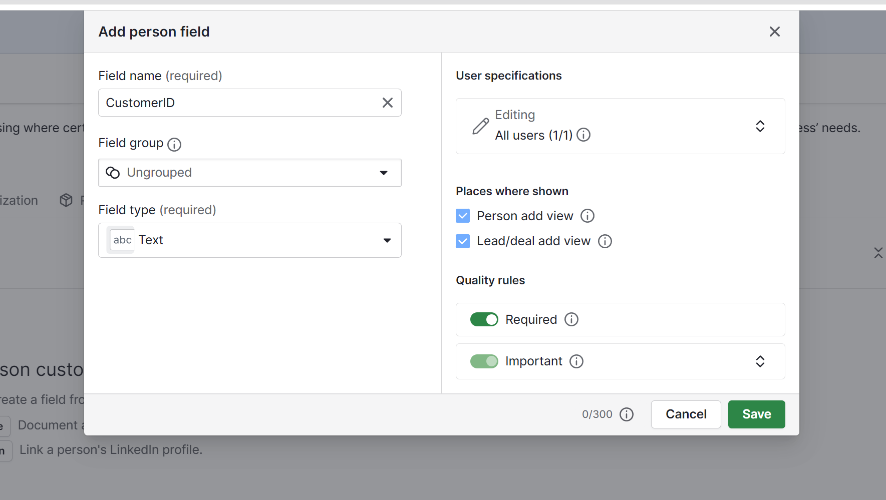
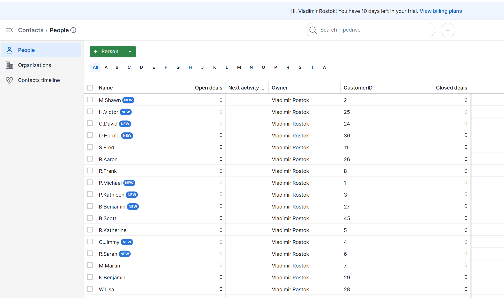
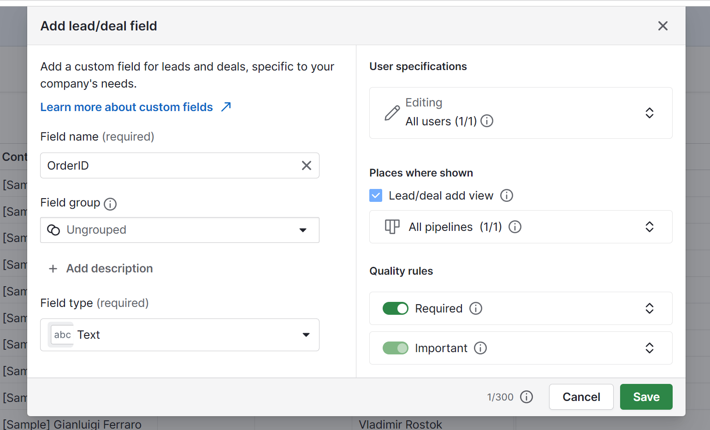
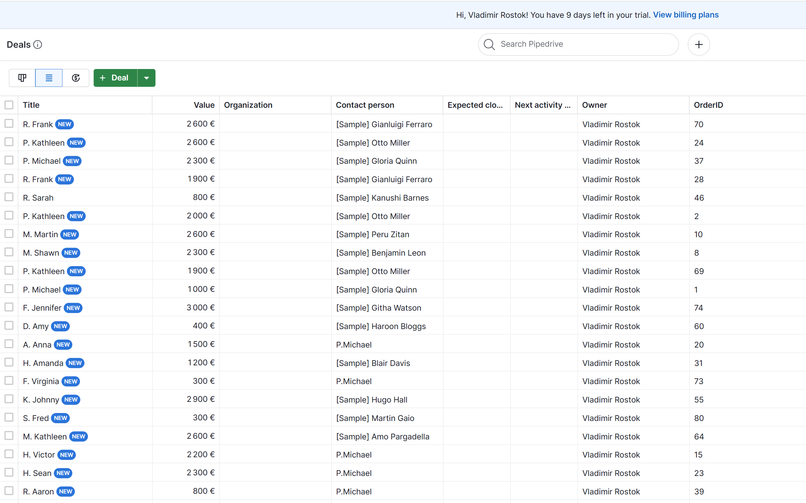
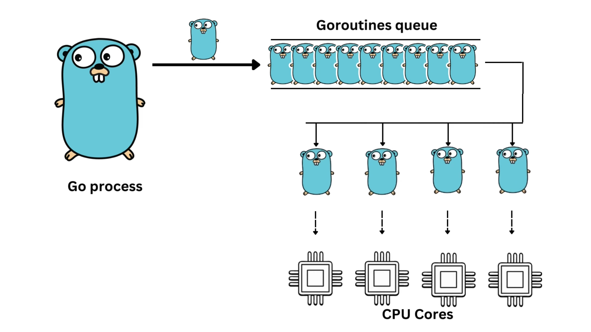

# Development Background

## The perfect optimization (had not enough time to do it).

Technically, we don't need to write any files to disk completely, but for now we take HTTP GET response body as a stream and write bytes to buffer, when buffer reaches the cap we flush data to the disk in one operation.

At the buff_batch_reader we do the same process again but in reverse order, we open the file stream and read data into buffer, and then we process the buffer to get batch of models, this full-download-to-disk operation can be dropped and replaced with shared data channel from HTTP reader.

Altough this will result in greater performance, the task definition sets a limit to ". In any case you should not spend more than 8 hours on this task." so it was out of scope.

## Achieved optimizations and architecture

The primary focus is to switch from **I/O Bound** processing to **CPU Bound** processing whenever possible and reasonable (e.g., download file fully before processing data, here we opt for data consistency balance).
Disk is cheapest memory and also slowest (we use it to store complete data for consistency), RAM is faster but often limited in sizes (we use it to process data in batches), CPU is fastest and we also utilize channel pipelining to avoid intermediate variables and use memory efficiently (and hope small channel hits the CPU cache).

### Step 1: Download files

We reuse HTTP client and connections whenever we can, plus additionally:

1. **Concurrency**: We process downloading for all specified files concurrently in separate goroutines.
2. **Buffered HTTP downloader** : We process HTTP GET request body in realtime as a stream and simultaneously read data into the buffer e.g., 32kb of data until we fill it.
3. **Buffered batch writing**: when buffer getting full we process downloaded buffer from last step and write **data batch to disk in 1 operation**, then read more until the buffer is full and flush it to disk in one operation again.

- NB! Read top section "The perfect optimization", we can avoid this disk operation fully and process batches in buffered channel if given enough time to develop this.

### Step 2: Read downloaded CSV files

1. **Concurrency & channeling**: We instantly return data channel and run data reading in goroutine to fill the channel concurrently not blocking the thread.
2. **Buffered Reader**: We process system file reader in realtime as a stream and simultaneously read data to memory in batches to buffer of e.g., batch of 4kb of unprocessed data.
3. **Batch buffer processing**: We take data buffer and prepare a batch of objects from this data batch and fill the output until we get desired batch capacity.
4. **Batch channel output**: We write batch of results to the output channel in one operation.

### Step 3: Concatenate related data to craft processable records and sum up payments value.

Because all 3 CSV files share foreign keys we need to compose a set of processable records as we don't have database to do this for us. Due to nature of dataset we have to iterate through all the data at least once to compare ID-s from different files and compose a united dataframe.

The data data concatenation and payments summing are split into different steps, both data processors designed to multi-parallel CPU calculations and and utilize buffered batch channeled data to best of ability.

# NB! Performance nuance and solution

Achieving performance here is challenging as data processing might lead to horrible I/O Bound task in the system on big data volumes, but because we read data in batches and streamline it over channels we have reduced the I/O bottleneck and memory usage significantly.

1. We never read the file fully into RAM, nor we download, save or read it, that way we opt for partial processing and use the least RAM to achieve this, file of any size can be processed.
2. Data is pre-read (buffered) from the disk in large batches, from disk to RAM ahead
3. it concurrently processes the buffer to fill the reader data channels with batches of data ahead
4. Processors run data concurrently and multi-core, we use channels and buffers/batches everywhere to avoid losses on I/O and intermediate variables
5. Deals and Persons are processed simultaneously, if data is ready it's sent to workers
6. There is a http worker pool implementation with buffer of tasks and results, these work concurrently and pattern can be used to switch it to any other custom connections implementation.
7. Data algorithm runs multi-core where it's applicable (we loop over batches in goroutines, it's benificial on batches of large objects and nested logic)
8. TODO: SumPayments has example of setting unused slice to `nil`, that way we can help the Go's garbage cleaner.

## **Running data in buffered channels as batches and executing it multi-core improved the performance significantly**

## **Every concatenate step has been parallelized, watch `concurrent_data_concatenator.go` file.**

- **Batch channel reader**: reads data (customer->order->payment) in batches through channels and flushes data batches every time we finish iterating, e.g., we reduce amount of disk operations by flushing writer only after we processed the entire batch, on different situations it can be flushed more often.

### Step 4: Synchronize customers

1. **Concurrency**: This task runs concurrently and listens to `customers` channel coming from the customers batch reader and passes `customers` channel to customers Create `POST` requests from processor.

On the first run when we add customers to empty Pipedrive, Pipedrive internally generates internal ID for every record and we have no control of it. **Pipedrive account has been configured to include a custom field (CustomerID) and write it alongside the object to map the data more easily in future processing**.

Customers added to Pipedrive CRM have their own internally generated ID, so we must process every local customer **using the smallest local file** we have with relevant data (customers.csv) against every customer object returned from the Pipedrive CRM. Because we have uploaded CustomerID from CSV file as custom field to Pipedrive now we have reliable mapping between these. We process it concurrently and if we have any new customer we pass them to the `customers` channel to the customers processor.

### Step 5: Synchronize deals

1. **Concurrency**: This task runs concurrently and listens to `deals` channel from the deals batch reader and creates new `newDeals` and `outOfSyncDeals` channels that are being consumed by Create `POST` and Update `PUT` request processors.

**We use combined file of pre-processed records to have all data for deal creation, such as Payment Amount, Customer ID, Order Date and Title for the order.**

On the first run when we add deals to empty Pipedrive, Pipedrive internally generates internal ID for every deal and we have no control of it. **Pipedrive account has been configured to include a custom field (OrderID) and write it alongside the object to map the data more easily in future processing**.

Deals added to Pipedrive CRM have their own internally generated ID, so we must process every local deal we have with relevant data (combined.csv) against every deal object returned from the Pipedrive CRM. Because we have uploaded deal with Title as “LastName FirstName” from CSV file we have reliable mapping between these. We process it concurrently and if we have any new deal we pass them to the `newDeals` and `outOfSyncDeals` channels to the deals processor.

### Extras and "Systemd Daemon"-like Daily Automation

The sync task is packed in a function, it is wrapped by the Daemon Runner to run this task as a background job to synchronize the data, the interval can be configured from the .yaml file and job will run forever in the background.

The concept of a daemon runner can be replaced with simple request, as alternative to run this from CLI the `Kubernetes`/`System CronJob` or called regularly by and Worker in the cloud.

# Worker pool for data processing

Given that all `partial file processing`, `Write to disk`, `Read from disk`, `Batch file processing`, `pipelines` ,`buffered channel`, `Batch data processing`, `Reusable HTTP Client + Connection`, optimizations are already on place, we can utilize the `Concurrent Worker Pool` to streamline data from readers and use this as part of Data Processor.

The Golang HTTP Client has standard http.Transport{} implementation with pool of Idle/Max connections we can use it's power, but we also can use `pipeline_processor.HttpWorkerPool` implementation as basis to integrate any database/custom client in future.

- **Since Readers return channels and Processor accepts and returns channels and Worker Pool has buffered channel of jobs, we can tune service for our performance needs with amount of workers and buffer size.**

## Tools and configuration

### Tools

- Multi-stage Docker build with `Dockerfile` and `docker-compose` setup
- sample `GitHub workflow` action setup
- Monorepo-style repository design
- Viper configuration loader
- Zap structured logger
- Interfaces for code generability
- Mockgen to generate mocks for interfaces
- GinkGo/Gomega DDD-like testing packages (TODO:)

### Configuration:

1. Reliable YAML configuration
2. HTTP client request timeout & buffer size
3. reader batch size & size for buffered channels
4. Workers jobs & results buffer size
5. Interval for Daemon task runner
6. TODO: ErrorsLogFile/Retry jobs file
7. MaxProcessors GOMAXPROCS setting
8. List of URLs and filenames to download data
9. Name for the combined files
10. Adjustable Pipedrive custom CustomerID and OrderID field hashes (TODO:)
11. env PIPEDRIVE_API_KEY variable for API key

## Out of scope

1. Log errors to errors.txt file for logging
2. Log failed jobs to failed_jobs.txt file for future retry
3. Retry failed HTTP requests on errors in workers
4. Retry failed jobs from failed_jobs.txt file
5. Implement Dynamic Rate Limiter for data processor clients (HTTP/PostgreSQL/custom)
6. Try Redis/Queue to split data processor and massively spawn worker pods in K8s?
7. Implement complete pagination reader for Pipedrive HTTP API + add YAML configuration for Size and Limit
8. Thorough tests

# Summary

It's Test task for Data Platform Engineer.

This repository contains the ["Test task for Data Platform Engineer" definition file](Test%20task%20for%20Data%20Platform%20Engineer.pdf) and the [Go project code itself](/app/Go/).

# Running

## NB! Set `PIPEDRIVE_API_KEY` ENV variable to run this code and also align .yaml file configuration with hashes of OrderID and CustomerID fields in your account.

Go to the [/app/Go/pipedrive-sync/cmd](/app/Go/pipedrive-sync/cmd/) directory and execute `go run sync.go` .

To run the entire Go codebase tests go to [/app/Go/](/app/Go/) directory and execute `go test ./...`

# Running in Docker Compose

Go to the [/app/Go/](/app/Go/) and execute the `docker-compose up --build`

## Build the pipedrive-sync service Dockerfile manually

Go to the [/app/Go/](/app/Go/) and build the container using `docker build --no-cache -f pipedrive-sync/Dockerfile . -t pipedrive-sync-image` and run this as `docker run -t pipedrive-sync-image` to launch the built image.

NB! `go.sum` file is located at the `/Go/` directory while the Dockerfile is located at the `/Go/pipedrive-sync/` directory, so we execute `build` command from the directory with `go.sum` file directory which is a `/Go`/ directory and point to Dockerfile with `-f` flag, executing from local (go.sum file) context `.` and naming the container with `-t` flag.

## Tech Stack

- Golang 1.23.0 standard library + zap logger + viper configuration reader
  - Docker
  - Docker Compose

# Extras

## [CMD pattern](https://github.com/golang-standards/project-layout/blob/master/cmd/README.md)

CMD pattern - a file convention in Go, helps to manage multiple main.go entry-points in the future and reuse the code, this also helps to keep the root directory clean [e.g., Kubernetes uses this pattern a lot](https://github.com/kubernetes/kubernetes/tree/master/cmd).
